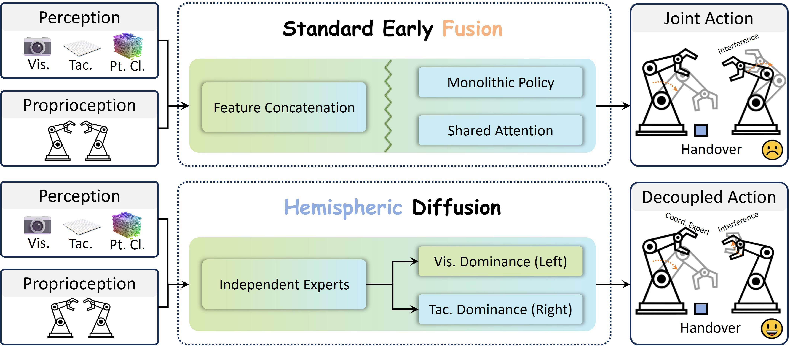

<div align="center">

#  Hemispheric Diffusion

**A Compositional Generative Policy for Coordinated Bimanual Manipulation**

[](https://yechen056.github.io/HemiDiff/)
[](#)
[](LICENSE)
[](https://www.python.org/)
[](https://pytorch.org/)

[Yechen Fan](https://github.com/yechen056)<sup>1,2*</sup>, [Jinhua Ye](#)<sup>1,2*</sup>, [Xinyou Ji](#)<sup>1</sup>, [Haibin Wu](#)<sup>1</sup>, [Gengfeng Zheng](#)<sup>2†</sup> and [Huixin He](#)<sup>3†</sup>

<sup>1</sup> Fuzhou University &nbsp;&nbsp; <sup>2</sup> Fujian Key Laboratory of Special Intelligent Equipment Safety Measurement and Control &nbsp;&nbsp; <sup>3</sup> Huaqiao University

*Equal contribution &nbsp;&nbsp; † Corresponding authors*

**[[Project Page](https://yechen056.github.io/HemiDiff/)] | [[Paper](#)]**

</div>

<div align="center">
  
</div>

<p align="justify">Hemispheric Diffusion enhances robustness by using an asymmetric routing mechanism to mask failed modalities and dynamically adjust multimodal contributions without retraining, unlike standard early-fusion strategies.</p>

## 📖 Overview

**Hemispheric Diffusion** is a bimanual control framework that addresses modality dominance (vision suppressing tactile cues) while enforcing physical coordination between two arms. 

- **Asymmetric Perception Router:** Dynamically reweights left/right perceptual streams according to occlusion and contact states.
- **Independent Modality Experts:** Supports sensor masking at inference time (e.g., broken camera or tactile stream) without retraining.
- **Coordination Energy Expert:** Adds geometric consistency during diffusion denoising to avoid collision and desynchronization.

<div align="center">
  
</div>

---

## 🛠️ Installation

<details>
<summary><b>Click to installation steps</b></summary>

### 1. Create Conda Environment
> 💡 We recommend using `mamba` for environment setup. If this step fails, see **Section 4 (Manual Installation)**.

```bash
git clone --recursive https://github.com/yechen056/Hemispheric-Diffusion.git
cd Hemispheric-Diffusion

conda install -n base -c conda-forge mamba -y
mamba env create -f conda_environment.yaml
conda activate hemidiff

pip install -e .

pip install -e third_party/PyRep
pip install -e third_party/RLBench
pip install -e third_party/YARR --no-deps
pip install -e third_party/pytorch3d --no-build-isolation
```

### 2. Install CoppeliaSim 4.1

```bash
mkdir -p ~/.coppeliasim
wget https://downloads.coppeliarobotics.com/V4_1_0/CoppeliaSim_Edu_V4_1_0_Ubuntu20_04.tar.xz
tar -xf CoppeliaSim_Edu_V4_1_0_Ubuntu20_04.tar.xz -C ~/.coppeliasim --strip-components 1
```

Add to `~/.bashrc`:

```bash
export COPPELIASIM_ROOT=${HOME}/.coppeliasim
export LD_LIBRARY_PATH=LDLIBRARYPATH:LD_LIBRARY_PATH:COPPELIASIM_ROOT
export QT_QPA_PLATFORM_PLUGIN_PATH=$COPPELIASIM_ROOT
```

Then reload:

```bash
source ~/.bashrc
```

### 3. Sanity Check

```bash
python -c "import torch; print(torch.__version__, torch.version.cuda, torch.cuda.is_available())"
python -c "import pyrep, rlbench, yarr, pytorch3d; print('core deps ok')"
python -c "from hemidiff.env.rlbench.gen_data import gen_rlbench_data; print('rlbench command import ok')"
```

### 4. Manual Installation (Optional)

<details>
<summary><b>Click to show manual installation steps</b></summary>

```bash
conda create -n hemidiff python=3.9 -y
conda activate hemidiff
conda install -n base -c conda-forge mamba -y
mamba install pytorch=2.1.0 torchvision=0.16.0 torchaudio=2.1.0 pytorch-cuda=12.1 -c pytorch -c nvidia -y

pip install -r requirements.txt

cd third_party/PyRep && pip install -e .
cd ../RLBench && pip install -e .
cd ../YARR && pip install -e . --no-deps
cd ../pytorch3d
pip install -e . --no-build-isolation
cd ../../
```
> 💡 Then continue with **Section 2 (Install CoppeliaSim 4.1)**.

</details>
</details>

---

## 🚀 Quick Start

### 🗂️ 1. Generate Demonstrations

```bash
python scripts/gen_rlbench_bimanual_data.py gen rlbench -t coordinated_push_box -c 100
```

Arguments:
- `-t`: Task name (e.g., `coordinated_push_box`)
- `-c`: Number of episodes

Supported simulation tasks:
- `bimanual_straighten_rope`
- `coordinated_lift_ball`
- `coordinated_lift_tray`
- `coordinated_push_box`
- `coordinated_put_item_in_drawer`
- `dual_push_buttons`

We provide the `coordinated_put_item_in_drawer` task assets on Hugging Face:

- Dataset (100 demos): [Download from Hugging Face](https://huggingface.co/datasets/yechen056/drawer/resolve/main/coordinated_put_item_in_drawer_expert_100.zarr.zip)
- Model: [Download from Hugging Face](https://huggingface.co/yechen056/drawer/resolve/main/latest.zip)
> Note: Extract the model to output/checkpoints/ and the dataset to data/rlbench/.

### 🚆 2. Train

```bash
python scripts/train.py \
  --config-name train_hemi_rgb_pcd_dino \
  task=rlbench/coordinated_push_box \
  task.dataset.zarr_path=data/rlbench/coordinated_push_box_expert_100.zarr
```

### 🎯 3. Evaluate

```bash
python scripts/eval.py \
  -c output/checkpoints/latest.ckpt \
  -o output/eval \
  -n 100
```

💡 Rollout videos are saved to `output/eval/media/`.

---

<!-- ## 📝 Citation

```bibtex
@article{fan2025hemidiff,
  title={Hemispheric Diffusion: A Compositional Generative Policy for Coordinated Bimanual Manipulation},
  author={Fan, Yechen and Ye, Jinhua and Ji, Xinyou and Wu, Haibin and Zheng, Gengfeng and He, Huixin},
  journal={arXiv preprint arXiv:XXXX.XXXXX},
  year={2025}
}
``` -->

## 📄 License

This project is released under the [MIT License](LICENSE).

## 🙏 Acknowledgements

This work builds upon excellent open-source projects including [Diffusion Policy](https://github.com/real-stanford/diffusion_policy), [RLBench](https://github.com/stepjam/RLBench), [PyRep](https://github.com/stepjam/PyRep), [Multi-Modal Policy Consensus](https://github.com/policyconsensus/policyconsensus), and [Perceiver-Actor^2](https://github.com/markusgrotz/peract_bimanual). We thank the authors and maintainers for their contributions.
